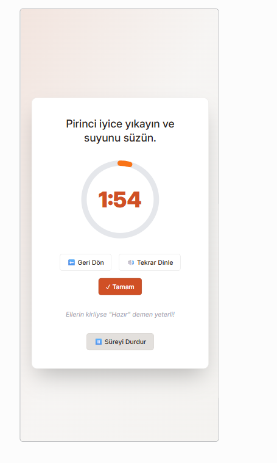

# 🧠 Akıllı Tarif Asistanı

Yapay Zeka Yarışması için geliştirilen, **Türkçe sesli komutlarla** yemek tariflerini adım adım anlatan **akıllı mutfak asistanı** uygulamasıdır.

Kullanıcı, elleri meşgulken bile “**Hazır**” diyerek sonraki adıma geçebilir. Uygulama tarifi sesli olarak okur, süre tutar, malzeme miktarlarını kişi sayısına göre ayarlar ve adım adım ilerler.

---

## 🚀 Canlı Demo

🔗 [Uygulamayı Deneyin](https://0a4ca9be-5d64-4108-866a-b83b0e7a8618-00-hdu2ksfiakxv.kirk.replit.dev/)
> ⚠️ Bu bağlantı Replit ücretsiz sürümünden çalışmaktadır. Replit sunucusu uyku moduna geçtiğinde geçici olarak erişilemeyebilir. Demo sürümü replit üzerinden denemek için bana ulaşabilirsiniz!
> Not: Mikrofon özelliği yalnızca Chrome veya Edge tarayıcısında çalışır.

---

## 💡 Özellikler

- 🔊 Türkçe sesli tarif okuma  
- 🗣️ “Hazır” komutuyla eller serbest adım geçişi  
- ⏱️ Geri sayım süresi ve durdur/devam ettir özelliği  
- 👥 Kişi sayısına göre otomatik malzeme hesaplama  
- 🌐 Tamamen tarayıcıda, ücretsiz ve internetsiz çalışma  
- 📱 Mobil uyumlu modern arayüz

---

## 🛠️ Kullanılan Teknolojiler

- **React + TypeScript**  
- **Web Speech API** (SpeechRecognition + SpeechSynthesis)  
- **Vite** geliştirme ortamı  
- **Shadcn/UI + Tailwind CSS** modern tasarım

---

## 📸 Uygulama Görselleri

### 1️⃣ Giriş Ekranı
.png)

### 2️⃣ Mikrofon İzni
.png)

### 3️⃣ Tarif Seçimi
.png)

### 4️⃣ Malzeme Görünümü
.png)

### 5️⃣ Sesli Pişirme Adımı

### 6️⃣ Tamamlanan Tarif
.png)

---
## 🔮 İlerde Planlanan Geliştirmeler

- 📱 Mobil cihazlar için tam duyarlı tasarım  
- 🧠 Yemek adımlarında otomatik süre tahmini (AI destekli)  
- 🍳 Kendi tarifini ekleme ve kaydetme özelliği  
- 🎙️ Sesli asistanın farklı tonlarda konuşabilmesi  
- 🥗 Kullanıcıya göre önerilen tarif sistemi (beslenme tercihine göre)  
- ☁️ Cloud senkronizasyonu ve kullanıcı hesabı desteği  

## 👩‍💻 Geliştirici
**Büşra Eryılmaz**

---

## 📄 Açıklama
Bu proje, yapay zekâ destekli mutfak asistanı fikrini **yerel Türkçe dil desteğiyle** hayata geçirmeyi hedefler.  
Türkiye’deki yemek tarif sitelerinde benzeri olmayan, sesle kontrol edilebilen akıllı tarif deneyimi sunar.

---

> © 2025 Büşra Eryılmaz – Yapay Zeka Yarışması Projesi
